- 👋 Hi, I’m @iloeng
- 👀 I’m interested in Python/C/Pascal...
- 🌱 I’m currently learning Python/C/Pascal...
- 💞️ I’m looking to collaborate on ...
- 📫 How to reach me https://github.com/iloeng

<!---

--->

[

<!---

--->

<!---
iloeng/iloeng is a ✨ special ✨ repository because its `README.md` (this file) appears on your GitHub profile.
You can click the Preview link to take a look at your changes.
--->
